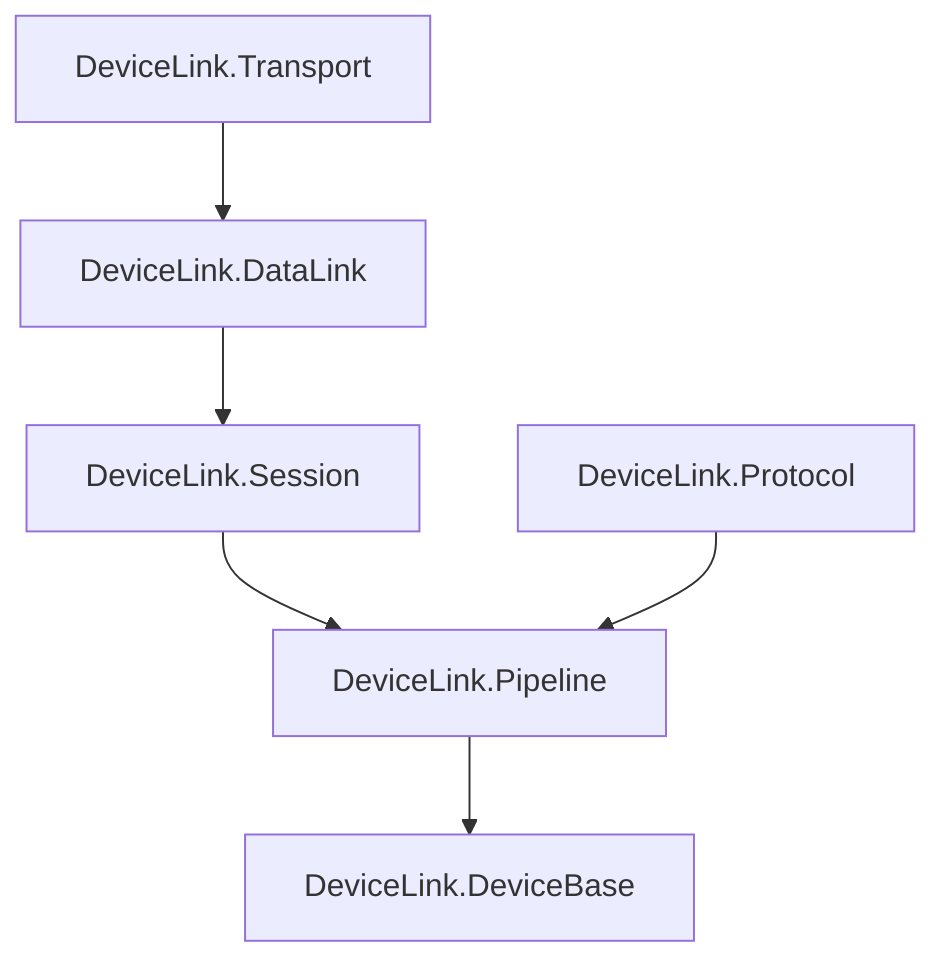

## 产品概述

在Core层每个项目内部建立子文件夹分类，将接口、模型、异常、实现等按职责分离存放，解决接口文件混合过多类型的问题，提高代码可读性和维护性。

## 核心功能

1. **Protocol 项目拆分**：将 IProtocolCodec.cs（233行，5种类型）拆分为独立文件
2. **DataLink 项目拆分**：将 IDataLink.cs（121行，3种类型）拆分为独立文件
3. **Session 项目拆分**：将 ISession.cs（78行，2种类型）拆分为独立文件
4. **Transport 项目整理**：将 Options 类从实现文件中提取出来
5. **DeviceBase 项目整理**：将 DeviceException 从基类文件中提取出来

## 技术栈

- 语言：C# 10
- 目标框架：netstandard2.0 + net6.0（双目标）
- 构建系统：SDK-style csproj

## 技术架构

### 子文件夹结构规范

每个项目统一建立以下子文件夹：

```
项目名/
├── Interfaces/      # 接口定义文件
├── Models/          # 数据模型、枚举、配置类
├── Exceptions/      # 异常类
├── Implementations/ # 实现类（可选）
├── 项目名.csproj
└── README.md
```

### 命名空间规则

文件移动到子文件夹后，**命名空间保持不变**。C# 允许文件夹结构与命名空间不同，这样可以避免大量 using 语句的修改。

### 各项目具体拆分方案

#### 1. DeviceLink.Protocol 项目

**当前问题**：`IProtocolCodec.cs` 包含5种类型（233行）

**拆分方案**：

| 原文件 | 新位置 | 类型 |
| --- | --- | --- |
| IProtocolCodec.cs | Interfaces/IProtocolCodec.cs | 接口 |
| IProtocolCodec.cs | Models/Command.cs | 数据模型 |
| IProtocolCodec.cs | Models/CommandKind.cs | 枚举 |
| IProtocolCodec.cs | Models/Response.cs | 数据模型 |
| IProtocolCodec.cs | Exceptions/ProtocolException.cs | 异常类 |


**最终结构**：

```
DeviceLink.Protocol/
├── Interfaces/
│   └── IProtocolCodec.cs
├── Models/
│   ├── Command.cs
│   ├── CommandKind.cs
│   └── Response.cs
├── Exceptions/
│   └── ProtocolException.cs
├── Implementations/
│   ├── ConSTCodec.cs
│   ├── ScpiCodec.cs
│   └── ModbusRtuCodec.cs
├── DeviceLink.Protocol.csproj
└── README.md
```

#### 2. DeviceLink.DataLink 项目

**当前问题**：`IDataLink.cs` 包含3种类型（121行）

**拆分方案**：

| 原文件 | 新位置 | 类型 |
| --- | --- | --- |
| IDataLink.cs | Interfaces/IDataLink.cs | 接口 |
| IDataLink.cs | Interfaces/IFrameStrategy.cs | 接口 |
| IDataLink.cs | Models/DataLinkOptions.cs | 配置类 |


**最终结构**：

```
DeviceLink.DataLink/
├── Interfaces/
│   ├── IDataLink.cs
│   └── IFrameStrategy.cs
├── Models/
│   └── DataLinkOptions.cs
├── Exceptions/
│   └── DataLinkException.cs
├── Implementations/
│   ├── DirectDataLink.cs
│   ├── DelimiterFrameStrategy.cs
│   ├── FixedLengthFrameStrategy.cs
│   └── ModbusRtuFrameStrategy.cs
├── DeviceLink.DataLink.csproj
└── README.md
```

#### 3. DeviceLink.Session 项目

**当前问题**：`ISession.cs` 包含2种类型（78行）

**拆分方案**：

| 原文件 | 新位置 | 类型 |
| --- | --- | --- |
| ISession.cs | Interfaces/ISession.cs | 接口 |
| ISession.cs | Models/SessionOptions.cs | 配置类 |


**最终结构**：

```
DeviceLink.Session/
├── Interfaces/
│   └── ISession.cs
├── Models/
│   ├── SessionOptions.cs
│   └── MqttSessionOptions.cs
├── Exceptions/
│   └── SessionException.cs
├── Implementations/
│   ├── DirectSession.cs
│   └── MqttSession.cs
├── DeviceLink.Session.csproj
└── README.md
```

#### 4. DeviceLink.Transport 项目

**当前问题**：Options 类嵌入在实现文件中

**拆分方案**：

| 原文件 | 新位置 | 类型 |
| --- | --- | --- |
| IPhysicalTransport.cs | Interfaces/IPhysicalTransport.cs | 接口 |
| SerialPortTransport.cs | Implementations/SerialPortTransport.cs | 实现类 |
| SerialPortTransport.cs | Models/SerialPortOptions.cs | 配置类（从实现文件提取） |
| TcpTransport.cs | Implementations/TcpTransport.cs | 实现类 |
| TcpTransport.cs | Models/TcpOptions.cs | 配置类（从实现文件提取） |
| UdpTransport.cs | Implementations/UdpTransport.cs | 实现类 |
| UdpTransport.cs | Models/UdpOptions.cs | 配置类（从实现文件提取） |
| UsbTransport.cs | Implementations/UsbTransport.cs | 实现类 |
| UsbTransport.cs | Models/UsbOptions.cs | 配置类（从实现文件提取） |
| LoopbackTransport.cs | Implementations/LoopbackTransport.cs | 实现类 |
| TransportException.cs | Exceptions/TransportException.cs | 异常类 |


**最终结构**：

```
DeviceLink.Transport/
├── Interfaces/
│   └── IPhysicalTransport.cs
├── Models/
│   ├── SerialPortOptions.cs
│   ├── TcpOptions.cs
│   ├── UdpOptions.cs
│   └── UsbOptions.cs
├── Exceptions/
│   └── TransportException.cs
├── Implementations/
│   ├── SerialPortTransport.cs
│   ├── TcpTransport.cs
│   ├── UdpTransport.cs
│   ├── UsbTransport.cs
│   └── LoopbackTransport.cs
├── DeviceLink.Transport.csproj
└── README.md
```

#### 5. DeviceLink.DeviceBase 项目

**当前问题**：DeviceException 嵌入在基类文件中

**拆分方案**：

| 原文件 | 新位置 | 类型 |
| --- | --- | --- |
| DeviceBase.cs | DeviceBase.cs（保留原位置） | 基类 |
| DeviceBase.cs | Exceptions/DeviceException.cs | 异常类（从基类文件提取） |
| DeviceCommSettings.cs | Models/DeviceCommSettings.cs | 配置类 |


**最终结构**：

```
DeviceLink.DeviceBase/
├── Models/
│   └── DeviceCommSettings.cs
├── Exceptions/
│   └── DeviceException.cs
├── DeviceBase.cs
├── DeviceLink.DeviceBase.csproj
└── README.md
```

#### 6. DeviceLink.Pipeline 项目

**当前状态**：只有1个源文件，可以保持现状

**最终结构**：

```
DeviceLink.Pipeline/
├── CommunicationPipelineBuilder.cs
├── DeviceLink.Pipeline.csproj
└── README.md
```

### 实现注意事项

1. **命名空间不变**：文件移动后命名空间保持原样，避免影响外部引用
2. **using 语句**：移动文件时确保 using 语句正确
3. **构建验证**：每次移动后立即构建验证
4. **测试验证**：所有测试必须继续通过

### 项目依赖关系（不变）

