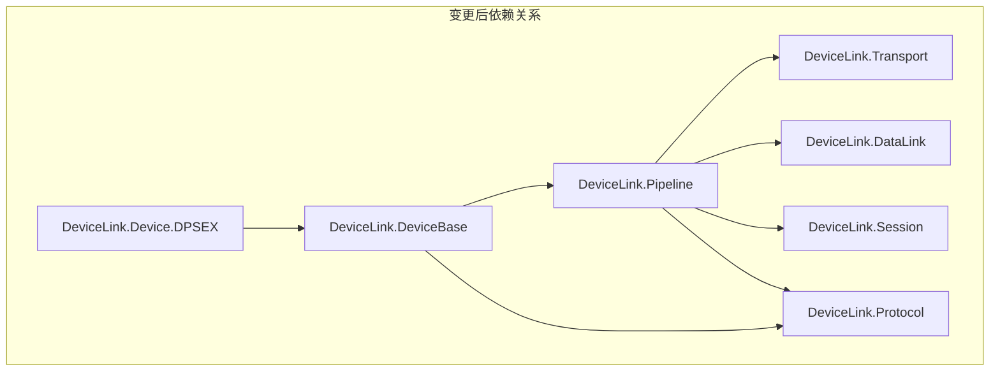
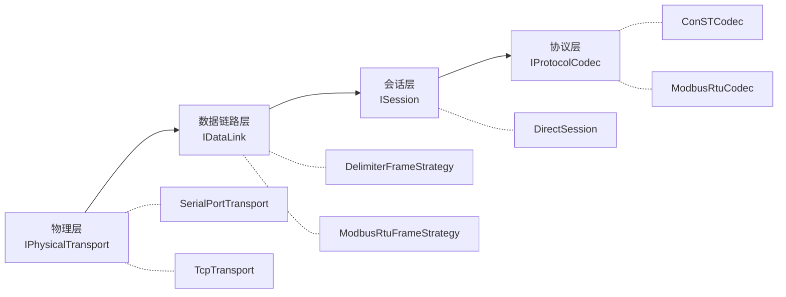

## 产品概述

重构 DeviceBase 层，使其引用 Pipeline 项目并复用 `CommunicationPipelineBuilder` 组装完整的 OSI 通信栈。删除 DeviceBase 中重复的通信栈组装逻辑，确保 DeviceBase 完全使用 OSI 模型的整个链路（物理层→数据链路层→会话层→协议层）。

## 核心功能

1. **DeviceBase 引用 Pipeline**：将 DeviceBase 的项目引用从直接引用 Transport/DataLink 改为引用 Pipeline（Pipeline 已包含这两个层）
2. **删除冗余代码**：移除 DeviceBase 中的 `CreateSerialSession`、`CreateTcpSession`、`CreateSessionFromSettings` 等与 Pipeline 重复的方法
3. **使用 CommunicationPipelineBuilder**：DeviceBase 内部持有 `CommunicationPipeline` 实例，所有构造函数通过 Pipeline 组装完整 OSI 通信栈
4. **DeviceCommSettings 适配**：配置类改为返回 `CommunicationPipeline`，使用 `CommunicationPipelineBuilder` 进行组装
5. **保持向后兼容**：保留原有 `DeviceBase(ISession, IProtocolCodec)` 构造函数签名
6. **更新测试**：确保所有测试继续通过

## 技术栈

- 语言：C# 10
- 目标框架：netstandard2.0 + net6.0（双目标）
- 构建系统：SDK-style csproj
- 测试框架：xUnit

## 技术架构

### 当前问题

DeviceBase 与 Pipeline 存在严重的代码重复：

| DeviceBase 中的冗余代码 | Pipeline 中的等价实现 |
| --- | --- |
| `CreateSerialSession()` | `PipelinePresets.CreateSerialPortPipeline()` |
| `CreateTcpSession()` | `PipelinePresets.CreateTcpPipeline()` |
| `DeviceCommSettings.CreateCommunicationStack()` | `CommunicationPipelineBuilder.Build()` |


当前依赖关系（两个层各自独立组装 OSI 链路）：

```
Transport ←── DeviceBase ──→ DataLink
    ↑              ↓              ↑
    └── Pipeline ──→ Session ──→ Protocol
```

### 解决方案

**DeviceBase 引用 Pipeline，复用 CommunicationPipelineBuilder**：



### OSI 模型链路

DeviceBase 通过 Pipeline 确保使用完整的 OSI 模型链路：



### 核心设计决策

1. **DeviceBase 依赖 Pipeline（单向）**：复用 `CommunicationPipelineBuilder` 的灵活组装能力
2. **CommunicationPipeline 作为通信栈载体**：DeviceBase 内部持有 `CommunicationPipeline`，它封装了完整的 OSI 链路（Transport + DataLink + Session + Protocol）
3. **DeviceCommSettings 适配 Pipeline**：配置类的 `CreateCommunicationStack()` 改为使用 `CommunicationPipelineBuilder` 返回 `CommunicationPipeline`
4. **ConstructDefaultInfo 虚方法保留**：基类提供空实现，子类重写
5. **保持向后兼容**：`DeviceBase(ISession, IProtocolCodec)` 构造函数保留，但内部通过 Pipeline 包装

### 实现细节

**DeviceBase 内部结构变更：**

- 私有字段 `_communicationStack` 改为 `CommunicationPipeline? _pipeline`
- 新增 `CommunicationPipeline Pipeline` 属性，暴露给子类
- `ISession Session` 改为从 `Pipeline.Session` 获取
- 删除 `CreateSerialSession`、`CreateTcpSession`、`CreateSessionFromSettings` 三个私有方法
- 所有便捷构造函数改为通过 `CommunicationPipelineBuilder` 构建

**DeviceCommSettings 适配变更：**

- `CreateCommunicationStack()` 返回类型从 `(IPhysicalTransport, IDataLink, ISession)` 改为 `CommunicationPipeline`
- 内部实现改为使用 `CommunicationPipelineBuilder`

**构造函数层级：**

```
// 基础构造函数（向后兼容，session-only 场景如测试/MQTT）
protected DeviceBase(ISession session, IProtocolCodec codec, ILogger? logger = null)

// 串口构造函数（完整参数，通过 PipelineBuilder 构建）
protected DeviceBase(string portName, int baudRate, int dataBits,
    StopBits stopBits, Parity parity, IProtocolCodec codec, ILogger? logger = null)

// 串口构造函数（默认配置）
protected DeviceBase(string portName, IProtocolCodec codec, ILogger? logger = null)

// TCP 构造函数
protected DeviceBase(IPAddress ipAddress, int port, IProtocolCodec codec, ILogger? logger = null)

// Settings 构造函数
protected DeviceBase(DeviceCommSettings settings, IProtocolCodec codec, ILogger? logger = null)
```

### 性能与可靠性

- **性能**：PipelineBuilder.Build() 内部是轻量级对象组装，无额外开销
- **资源管理**：`CommunicationPipeline` 已实现 `IDisposable`，DeviceBase 的 Dispose 直接委托给 Pipeline
- **错误处理**：PipelineBuilder 内置验证逻辑（如未设置传输层时抛出 `InvalidOperationException`）