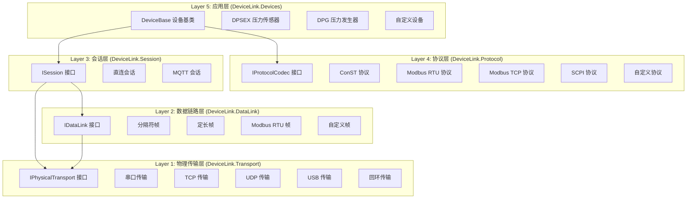
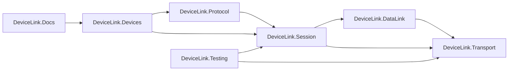

## 产品概述

基于OSI七层模型（简化为4-5层）完全重构DeviceLink设备通信框架，实现清晰的分层架构，支持Modbus RTU/TCP、SCPI、自定义协议等多种通信协议。

## 核心功能

1. **物理传输层**：统一的字节传输接口，支持串口、TCP、USB等物理介质
2. **数据链路层**：帧边界检测和帧组装/解析，支持分隔符帧、定长帧、Modbus RTU帧等
3. **会话层**：请求-响应会话管理，支持超时重试、线程安全
4. **协议层**：协议编解码器，支持ConST、Modbus RTU/TCP、SCPI、自定义协议
5. **应用层**：设备基类和具体设备实现，支持DPSEX、DPG等设备
6. **工厂/构建器**：通信管道构建器，支持灵活的层组合
7. **详细使用文档**：完整的API文档和使用示例

## 设计要求

- 每层接口保持简单，只暴露核心功能
- 所有IO操作支持async/await异步
- 支持CancellationToken取消令牌
- 分层错误处理：底层捕获底层异常，转换为上层能理解的异常类型
- 每层都是可插拔的，根据通信场景选择需要的层
- 支持依赖注入

## 技术栈

- **目标框架**：netstandard2.0 + net6.0（双目标）
- **语言版本**：C# 10
- **日志框架**：Microsoft.Extensions.Logging
- **依赖注入**：Microsoft.Extensions.DependencyInjection
- **测试框架**：xUnit
- **串口通信**：System.IO.Ports
- **网络通信**：System.Net.Sockets

## 技术架构

### 分层架构设计

### 项目依赖关系

## 实现细节

### 关键设计决策

1. **接口隔离原则**：每层定义独立的小接口，避免"上帝接口"
2. **依赖倒置**：上层依赖抽象接口，不依赖具体实现
3. **可插拔设计**：每层都是可选的，通过构建器模式灵活组合
4. **工厂模式**：提供通信管道构建器，简化复杂对象的创建

### 性能考虑

- 使用`SemaphoreSlim`保证线程安全
- 使用`ArrayPool<byte>`减少内存分配
- 支持异步IO操作，避免阻塞线程

### 错误处理策略

- **物理层**：捕获IOException、TimeoutException，转换为TransportException
- **数据链路层**：处理帧超时、帧格式错误，转换为FrameException
- **会话层**：处理连接断开、超时，转换为SessionException
- **协议层**：处理命令格式错误、响应解析错误，转换为ProtocolException
- **应用层**：处理业务错误（设备错误、参数错误）

## 代理扩展

### 子代理：code-explorer

- **用途**：在重构过程中探索现有代码，确保正确迁移所有功能
- **预期结果**：完整理解现有代码结构，避免遗漏关键功能