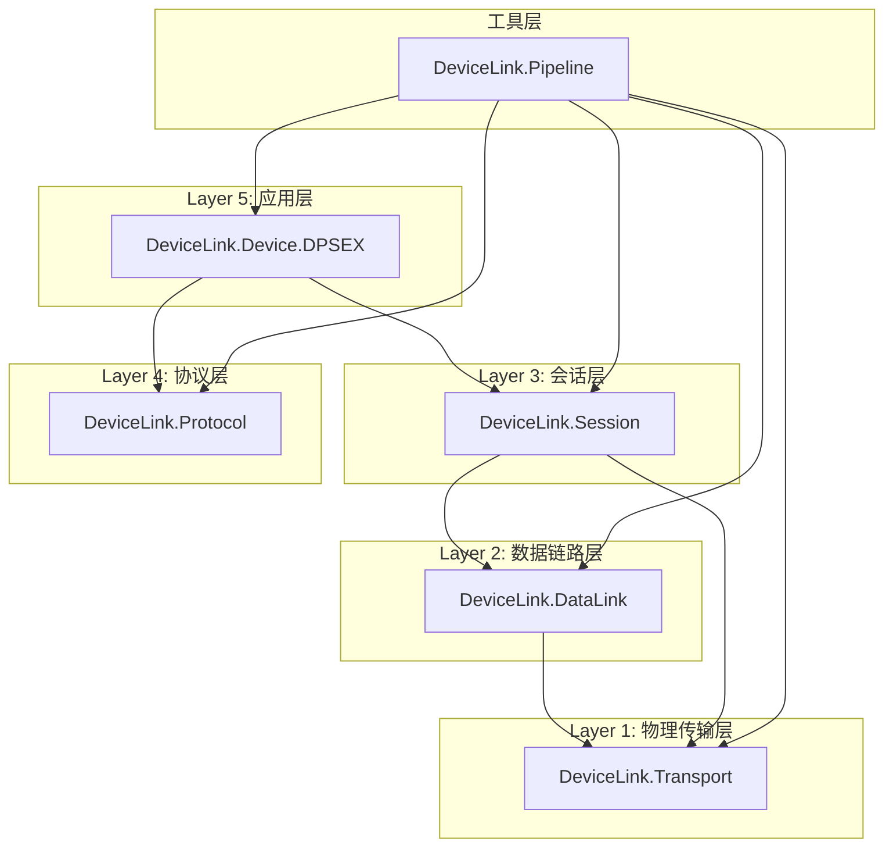
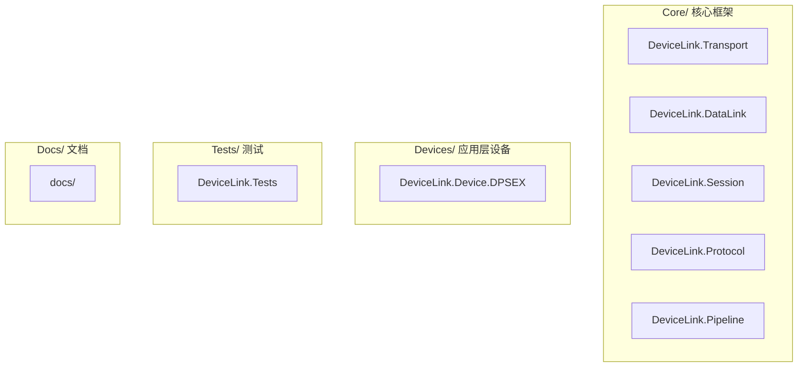

## 产品概述

将DeviceLink项目按照OSI五层通信模型重组为4个解决方案文件夹结构，统一使用旧架构，删除新架构冗余项目，建立清晰的项目组织层次。

## 核心功能

1. **重组解决方案文件夹结构**：将所有项目按职责分入Core、Devices、Tests、Docs四个文件夹
2. **拆分Devices项目**：将当前的DeviceLink.Devices项目拆分为独立的DeviceLink.Device.DPSEX类库，DeviceBase.cs保留在Core层
3. **删除新架构项目**：移除DeviceLink.Core、DeviceLink.Testing、DeviceLink.Devices.ConST.DPSEX、DeviceLink.Devices.ConST.DPSEX.Tests
4. **更新项目引用**：修改所有.csproj文件中的ProjectReference路径以适配新目录结构
5. **更新解决方案文件**：重新组织DeviceLink.sln中的项目分组和引用
6. **创建Docs文件夹**：创建空的docs/目录用于后续存放文档

## 技术栈

- 语言：C# 10
- 目标框架：netstandard2.0 + net6.0（双目标）
- 构建系统：Visual Studio 2022 SDK-style csproj
- 测试框架：xUnit 2.4.2 + Moq 4.18.4
- 串口通信：System.IO.Ports 6.0.0
- 日志：Microsoft.Extensions.Logging.Abstractions 6.0.0

## 技术架构

### 现有OSI五层依赖关系



### 重组后的目录结构



## 实现方案

### 方案概述

采用**目录迁移 + csproj更新 + 解决方案重组**的方式，按以下步骤执行：

1. 移动Core层项目到新目录
2. 拆分Devices项目（DeviceBase移到Core，DPSEX独立成DeviceLink.Device.DPSEX）
3. 移动Tests项目
4. 创建Docs目录
5. 删除新架构项目
6. 更新所有.csproj引用路径
7. 重新生成解决方案文件

### 关键决策

- **DeviceBase.cs移入Core层**：DeviceBase是所有设备的基类，属于框架基础设施，不应随设备实现一起迁移
- **设备命名**：从DeviceLink.Devices改为DeviceLink.Device.DPSEX，遵循用户要求的命名规范
- **Pipeline保留在Core**：Pipeline依赖所有层，作为组装工具归入Core层
- **旧测试保留在Tests**：DeviceLink.Tests中的TransportTests/DataLinkTests/ProtocolTests/SessionTests/DPSEXTests全部保留

### 需要删除的新架构项目

- `src/DeviceLink.Core/` — 新架构核心库（Channel模式），与旧架构重复
- `src/DeviceLink.Testing/` — 新架构测试工具，依赖Core
- `src/DeviceLink.Devices.ConST.DPSEX/` — 新架构DPSEX实现，依赖Core
- `test/DeviceLink.Devices.ConST.DPSEX.Tests/` — 新架构测试

## 实现细节

### 核心目录结构

```
g:/DeviceLink/
├── DeviceLink.sln                          # [MODIFY] 重新组织项目分组
├── README.md                               # [MODIFY] 更新架构说明
├── core/                                   # [NEW] Core解决方案文件夹
│   ├── DeviceLink.Transport/               # [MOVE] 从src/移入
│   │   └── DeviceLink.Transport.csproj     # [MODIFY] 无路径变化
│   ├── DeviceLink.DataLink/                # [MOVE] 从src/移入
│   │   └── DeviceLink.DataLink.csproj      # [MODIFY] 更新Transport引用路径
│   ├── DeviceLink.Session/                 # [MOVE] 从src/移入
│   │   └── DeviceLink.Session.csproj       # [MODIFY] 更新Transport/DataLink引用路径
│   ├── DeviceLink.Protocol/                # [MOVE] 从src/移入
│   │   └── DeviceLink.Protocol.csproj      # [MODIFY] 无路径变化
│   └── DeviceLink.Pipeline/                # [MOVE] 从src/移入
│       └── DeviceLink.Pipeline.csproj      # [MODIFY] 更新所有引用路径 + 移除Devices引用
├── devices/                                # [NEW] Devices解决方案文件夹
│   └── DeviceLink.Device.DPSEX/            # [NEW] 从DeviceLink.Devices拆分
│       ├── DeviceLink.Device.DPSEX.csproj  # [NEW] 独立项目文件
│       ├── DeviceBase.cs                   # [MOVE] 从src/DeviceLink.Devices移入
│       └── DPSEX.cs                        # [MOVE] 从src/DeviceLink.Devices移入
├── tests/                                  # [NEW] Tests解决方案文件夹
│   └── DeviceLink.Tests/                   # [MOVE] 从test/移入
│       ├── DeviceLink.Tests.csproj         # [MODIFY] 更新所有ProjectReference路径
│       ├── TransportTests.cs               # [KEEP]
│       ├── DataLinkTests.cs                # [KEEP]
│       ├── ProtocolTests.cs                # [KEEP]
│       ├── SessionTests.cs                 # [KEEP]
│       └── DPSEXTests.cs                   # [MODIFY] 更新命名空间引用
├── docs/                                   # [NEW] Docs解决方案文件夹
│   └── README.md                           # [KEEP] 保留原README
└── CDP-V05-rs232_scan多点拟合.c            # [KEEP]
```

### 需要删除的文件

- `src/DeviceLink.Core/` — 整个目录
- `src/DeviceLink.Testing/` — 整个目录
- `src/DeviceLink.Devices.ConST.DPSEX/` — 整个目录
- `src/DeviceLink.Devices/` — 已拆分到devices/DeviceLink.Device.DPSEX/
- `test/DeviceLink.Devices.ConST.DPSEX.Tests/` — 整个目录
- `src/` — 空目录删除
- `test/` — 空目录删除

### 关键csproj修改清单

**core/DeviceLink.DataLink/DeviceLink.DataLink.csproj**

- ProjectReference路径：`../DeviceLink.Transport/DeviceLink.Transport.csproj`（无需变化）

**core/DeviceLink.Session/DeviceLink.Session.csproj**

- ProjectReference路径：`../DeviceLink.Transport/DeviceLink.Transport.csproj` 和 `../DeviceLink.DataLink/DeviceLink.DataLink.csproj`（无需变化）

**core/DeviceLink.Pipeline/DeviceLink.Pipeline.csproj**

- ProjectReference路径：所有引用路径保持`../Xxx/Xxx.csproj`格式（无需变化）
- 移除对DeviceLink.Devices的ProjectReference（Pipeline不应直接依赖应用层设备）

**devices/DeviceLink.Device.DPSEX/DeviceLink.Device.DPSEX.csproj**

- 新建项目文件
- ProjectReference：`../../core/DeviceLink.Session/DeviceLink.Session.csproj` 和 `../../core/DeviceLink.Protocol/DeviceLink.Protocol.csproj`

**tests/DeviceLink.Tests/DeviceLink.Tests.csproj**

- 所有ProjectReference路径需要更新为：`../../core/Xxx/Xxx.csproj` 和 `../../devices/DeviceLink.Device.DPSEX/DeviceLink.Device.DPSEX.csproj`
- 移除对DeviceLink.Pipeline的引用（如果测试不直接使用Pipeline）

### 解决方案文件夹GUID映射

需要在DeviceLink.sln中创建4个解决方案文件夹：

- Core — GUID: 需要生成
- Devices — GUID: 需要生成
- Tests — GUID: 需要生成
- Docs — GUID: 需要生成

## 执行顺序

1. 创建新目录结构（core/, devices/, tests/, docs/）
2. 移动Core层项目文件
3. 拆分DeviceLink.Devices（DeviceBase.cs + DPSEX.cs → devices/DeviceLink.Device.DPSEX/）
4. 创建新的DeviceLink.Device.DPSEX.csproj
5. 移动测试项目
6. 更新所有.csproj文件中的路径引用
7. 重新生成DeviceLink.sln
8. 删除新架构项目和旧目录
9. 验证构建和测试通过