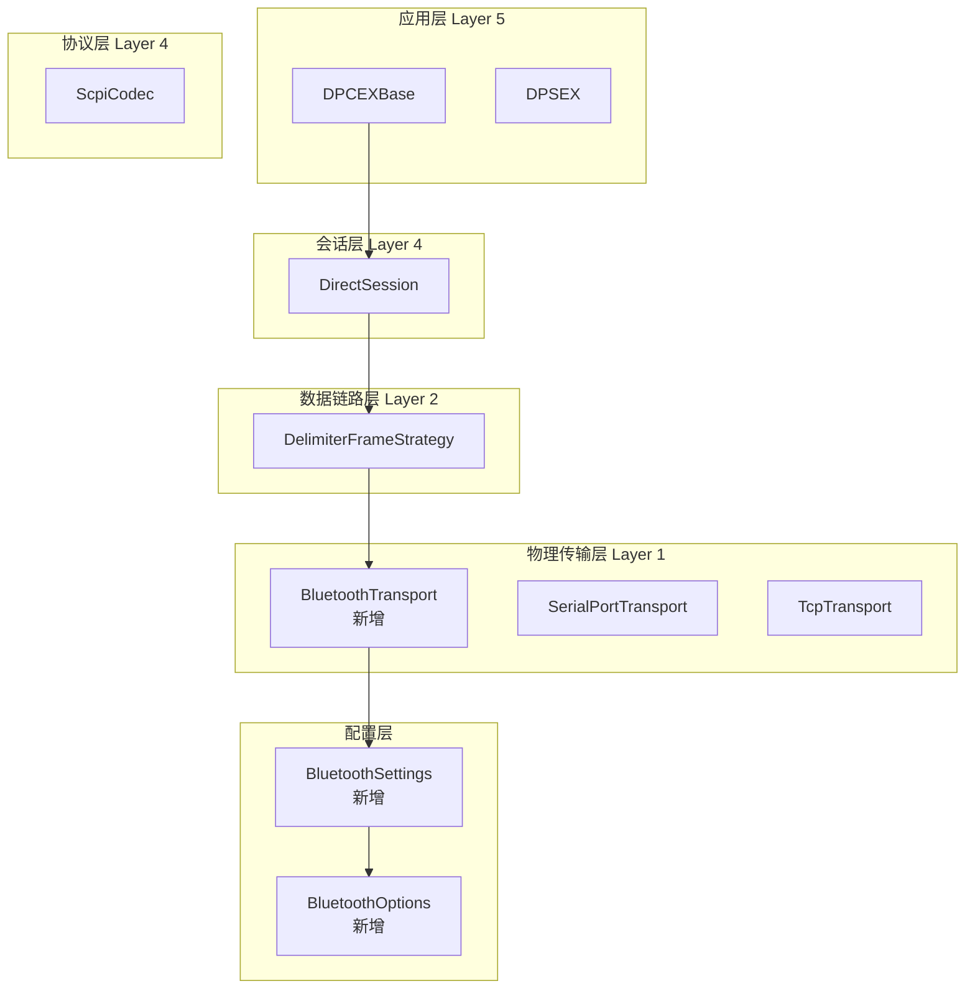

## 产品概述

在现有DeviceLink设备通讯框架中集成蓝牙通讯能力，使框架支持通过蓝牙（经典蓝牙RFCOMM/SPP）与设备进行数据交互。用户提到`DPCEXBase`支持蓝牙通讯，需要为ConST326EX系列设备添加蓝牙通讯方式。

## 核心功能

- 实现蓝牙物理传输层，支持经典蓝牙RFCOMM/SPP协议
- 提供蓝牙设备发现、配对、连接功能
- 支持蓝牙串口数据收发（与现有串口传输行为一致）
- 为DPCEXBase添加蓝牙通讯构造函数
- 支持通过DeviceCommSettings配置蓝牙连接参数
- 集成日志记录和异常处理机制

## 技术栈

- **语言**：C# (.NET 6.0 / .NET Standard 2.0)
- **蓝牙库**：`32feet.NET`（InTheHand.Net.Bluetooth）- 成熟的跨平台蓝牙库
- **框架依赖**：现有DeviceLink分层架构
- **目标平台**：Windows（后续可扩展到Linux/macOS）

## 技术方案

### 1. 实现方案概述

在现有DeviceLink分层架构的物理传输层（Layer 1）添加蓝牙传输实现，遵循`IPhysicalTransport`接口规范。采用经典蓝牙RFCOMM/SPP协议（Serial Port Profile），实现与串口传输类似的数据收发能力。

### 2. 架构设计



### 3. 关键类设计

#### 3.1 BluetoothOptions（蓝牙配置选项）

```
public class BluetoothOptions
{
    /// <summary>
    /// 蓝牙设备地址（MAC地址或蓝牙名称）
    /// </summary>
    public string DeviceAddress { get; set; }
    
    /// <summary>
    /// 蓝牙服务UUID（SPP默认：00001101-0000-1000-8000-00805F9B34FB）
    /// </summary>
    public Guid ServiceUuid { get; set; } = BluetoothService.SerialPort;
    
    /// <summary>
    /// 连接超时时间（毫秒）
    /// </summary>
    public int ConnectTimeoutMs { get; set; } = 10000;
    
    /// <summary>
    /// 读取缓冲区大小
    /// </summary>
    public int ReadBufferSize { get; set; } = 4096;
    
    /// <summary>
    /// 写入缓冲区大小
    /// </summary>
    public int WriteBufferSize { get; set; } = 2048;
    
    /// <summary>
    /// 是否在连接前自动配对
    /// </summary>
    public bool AutoPair { get; set; } = true;
    
    /// <summary>
    /// 配对PIN码（部分设备需要）
    /// </summary>
    public string? PinCode { get; set; }
}
```

#### 3.2 BluetoothTransport（蓝牙传输实现）

实现`IPhysicalTransport`接口，封装蓝牙RFCOMM连接：

- **ConnectAsync**：搜索并连接蓝牙设备，支持超时控制
- **ReadAsync**：从蓝牙流读取数据
- **WriteAsync**：向蓝牙流写入数据
- **CloseAsync**：关闭蓝牙连接并释放资源
- **ClearReceiveBufferAsync**：清空接收缓冲区

#### 3.3 BluetoothSettings（蓝牙通讯配置）

继承`DeviceCommSettings`，实现`CreatePipeline`方法：

```
public class BluetoothSettings : DeviceCommSettings
{
    public BluetoothOptions BluetoothOptions { get; set; }
    public byte[] Delimiter { get; set; } = new byte[] { 0 };
    public IFrameStrategy? FrameStrategy { get; set; }
    
    protected internal override CommunicationPipeline CreatePipeline(IProtocolCodec codec)
    {
        var dataLink = FrameStrategy ?? new DelimiterFrameStrategy(Delimiter);
        return new CommunicationPipelineBuilder()
            .UseTransport(new BluetoothTransport(BluetoothOptions))
            .UseDataLink(dataLink)
            .UseProtocol(codec)
            .Build();
    }
}
```

### 4. DeviceBase扩展

添加蓝牙相关的构造函数：

```
/// <summary>
/// 初始化设备基类（蓝牙通信）
/// </summary>
/// <param name="deviceAddress">蓝牙设备地址</param>
/// <param name="codec">协议编解码器</param>
protected DeviceBase(
    string deviceAddress,
    IProtocolCodec codec)
{
    Codec = codec ?? throw new ArgumentNullException(nameof(codec));
    Name = GetType().Name;
    
    var settings = new BluetoothSettings
    {
        BluetoothOptions = new BluetoothOptions { DeviceAddress = deviceAddress }
    };
    
    Pipeline = settings.CreatePipeline(Codec);
    ConstructDefaultInfo();
}
```

### 5. DPCEXBase扩展

添加蓝牙构造函数：

```
/// <summary>
/// 构造函数（蓝牙通讯方式使用）
/// </summary>
/// <param name="deviceAddress">蓝牙设备地址或名称</param>
public DPCEXBase(string deviceAddress)
    : base(new BluetoothSettings
    {
        BluetoothOptions = new BluetoothOptions 
        { 
            DeviceAddress = deviceAddress,
            ServiceUuid = BluetoothService.SerialPort
        }
    }, new ScpiCodec("\r\n"))
{
    _codec = (ScpiCodec)Codec;
}
```

### 6. NuGet包依赖

在`DeviceLink.Transport.csproj`中添加：

```xml
<PackageReference Include="InTheHand.Net.Bluetooth" Version="4.1.46" />
```

### 7. 异常处理

使用现有异常类型：

- `ConnectionException`：蓝牙连接失败
- `TransportException`：数据传输错误
- `TransportTimeoutException`：连接或操作超时

### 8. 实现要点

1. **线程安全**：蓝牙连接操作需要线程安全保护
2. **资源管理**：实现`IDisposable`，正确释放蓝牙资源
3. **异步操作**：所有操作使用`async/await`模式
4. **日志记录**：集成`CommunicationLogger`记录蓝牙通讯日志
5. **缓冲区管理**：实现环形缓冲区处理异步数据接收

## 关键技术决策

1. **选择经典蓝牙而非BLE**：设备通讯通常使用SPP协议，数据传输稳定可靠
2. **使用32feet.NET库**：成熟稳定，跨平台支持，社区活跃
3. **遵循现有架构模式**：与串口/TCP传输保持一致的接口和行为
4. **保持向后兼容**：新增功能不影响现有代码

## 性能与可靠性

- **连接超时**：默认10秒，可配置
- **缓冲区大小**：读4KB/写2KB，与串口传输一致
- **错误恢复**：连接断开时抛出异常，由上层处理重连逻辑
- **资源释放**：使用`using`语句和`Dispose`模式确保资源释放