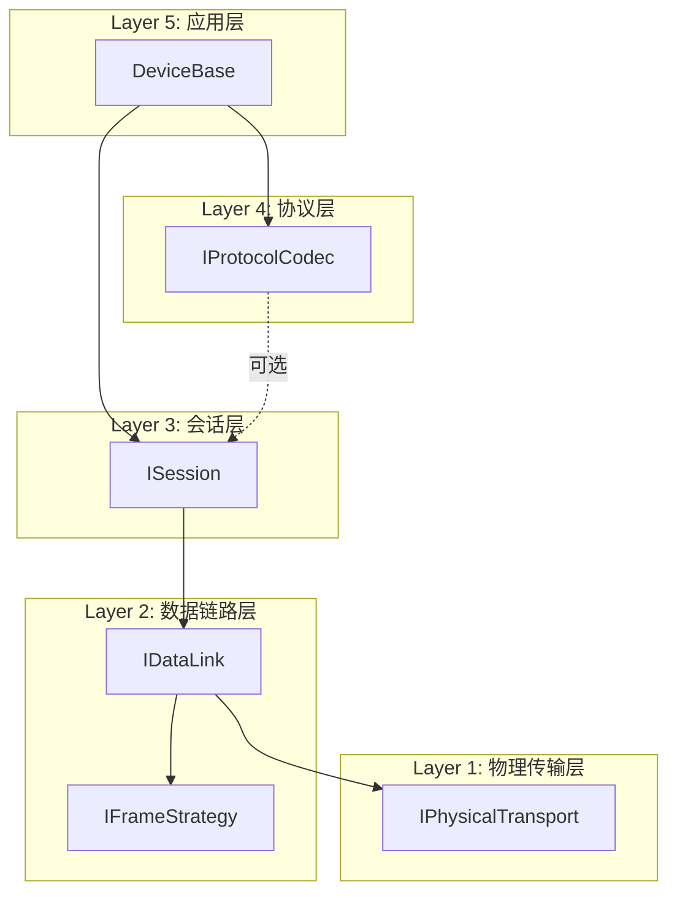

## 产品概述

为DeviceLink框架创建一份详细的工业通讯协议分层分析文档，明确各类协议在五层架构（物理传输层、数据链路层、会话层、协议层、应用层）中的归属位置，并基于分析结果规划项目功能完善路线图。

## 核心功能

1. **协议分层映射分析**：将蓝牙、CAN总线、GPIB、光纤、Zigbee/LoRa/NB-IoT、HART、PROFIBUS/PROFINET、EtherCAT、OPC UA等协议映射到DeviceLink的五层架构中
2. **现有架构评估**：分析当前已实现协议（串口、TCP、UDP、USB、ConST、SCPI、Modbus RTU）的分层合理性
3. **扩展需求识别**：识别需要新增的接口、类库和依赖包
4. **功能完善路线图**：制定优先级排序的实施计划

## 用户需求

用户希望获得一份详细的MD文档，说明各类工业通讯协议适合放在当前项目的哪一层，然后基于此分析如何完善项目功能。文档需要：

- 清晰说明每个协议的OSI层归属
- 说明与现有架构的集成方式
- 识别需要新增的组件
- 提供实施优先级建议

## 技术栈

- 语言：C# 10，Nullable enabled
- 目标框架：netstandard2.0 + net6.0（双目标）
- 构建系统：SDK-style csproj
- 测试框架：xUnit 2.4.2

## 技术架构

### 协议分层映射模型

基于OSI七层模型简化为五层架构：

### 协议归属分析矩阵

| 协议 | 物理层 | 数据链路层 | 协议层 | 会话层 | 说明 |
| --- | --- | --- | --- | --- | --- |
| 串口RS232/485 | ✅ SerialPortTransport | 分隔符/定长帧 | ConST/SCPI | DirectSession | 已实现 |
| TCP/IP | ✅ TcpTransport | 分隔符/定长帧 | SCPI/ModbusTCP | DirectSession | 已实现 |
| UDP | ✅ UdpTransport | - | 自定义 | DirectSession | 已实现 |
| USB | ✅ UsbTransport | 分隔符帧 | 自定义 | DirectSession | 已实现 |
| **蓝牙** | ✅ BluetoothTransport | 分隔符帧 | 自定义 | DirectSession | 需新增 |
| **CAN总线** | ✅ CanTransport | ✅ CanFrameStrategy | CANopen | DirectSession | 需新增 |
| **GPIB/IEEE-488** | ✅ GpibTransport | 分隔符帧 | SCPI | DirectSession | 需新增 |
| **HART** | ✅ HartTransport | ✅ HartFrameStrategy | ✅ HartCodec | DirectSession | 需新增 |
| **PROFIBUS** | ✅ ProfibusTransport | ✅ ProfibusFrameStrategy | ✅ ProfibusCodec | DirectSession | 需新增 |
| **PROFINET** | ✅ ProfinetTransport | Ethernet帧 | PROFINET协议 | ✅ ProfinetSession | 需新增 |
| **EtherCAT** | ✅ EtherCatTransport | ✅ EtherCatFrameStrategy | ✅ EtherCatCodec | DirectSession | 需新增 |
| **OPC UA** | TCP/HTTP | - | ✅ OpcUaCodec | ✅ OpcUaSession | 需新增 |
| **光纤** | 光电转换器→TCP/串口 | 复用现有 | 复用现有 | 复用现有 | 透明支持 |
| **Zigbee** | ✅ ZigbeeTransport | 分隔符帧 | AT指令 | DirectSession | 需新增 |
| **LoRa** | ✅ LoRaTransport | 分隔符帧 | AT指令 | DirectSession | 需新增 |
| **NB-IoT** | ✅ NbIotTransport | 分隔符帧 | AT指令 | DirectSession | 需新增 |

### 协议复杂度分类

#### A类：仅需物理层扩展（复用现有帧策略和协议）

- 蓝牙、GPIB、Zigbee、LoRa、NB-IoT、光纤

#### B类：需要物理层+数据链路层扩展

- CAN总线、HART、PROFIBUS、EtherCAT

#### C类：需要全新会话层或协议层

- PROFINET、OPC UA、Modbus TCP

### 实施优先级建议

**第一阶段（高优先级）**：

1. Modbus TCP - 复用现有Modbus RTU，仅需新增TcpOptions和ModbusTcpCodec
2. HART - 工业过程控制核心协议
3. Bluetooth - 物联网和移动设备支持

**第二阶段（中优先级）**：

4. CAN总线 - 汽车和工业自动化
5. GPIB - 仪器控制标准
6. OPC UA - 工业4.0标准

**第三阶段（低优先级）**：

7. PROFIBUS/PROFINET - 传统PLC通讯
8. EtherCAT - 高端运动控制
9. Zigbee/LoRa/NB-IoT - 物联网长距离通讯

### 关键技术决策

1. **第三方库选择**：

- 蓝牙：InTheHand.Net.Bluetooth (32feet.NET)
- CAN：PCAN-Basic API 或 SocketCAN
- GPIB：NI-488.2 或 linux-gpib
- OPC UA：OPCFoundation.NetStandard.Opc.Ua

2. **架构扩展模式**：

- 传输层工厂模式：`TransportFactory.Create(type, options)`
- 帧策略注册机制：`FrameStrategyRegistry.Register(name, factory)`
- 协议插件化：支持动态加载协议实现

3. **向后兼容性**：

- 保持现有接口不变
- 新增接口继承现有基础接口
- 通过适配器模式支持新旧协议

## Agent Extensions

### SubAgent

- **code-explorer**
- Purpose: 深入探索项目结构，分析现有协议实现模式，识别扩展点
- Expected outcome: 获得详细的架构分析报告，为协议分层映射提供依据