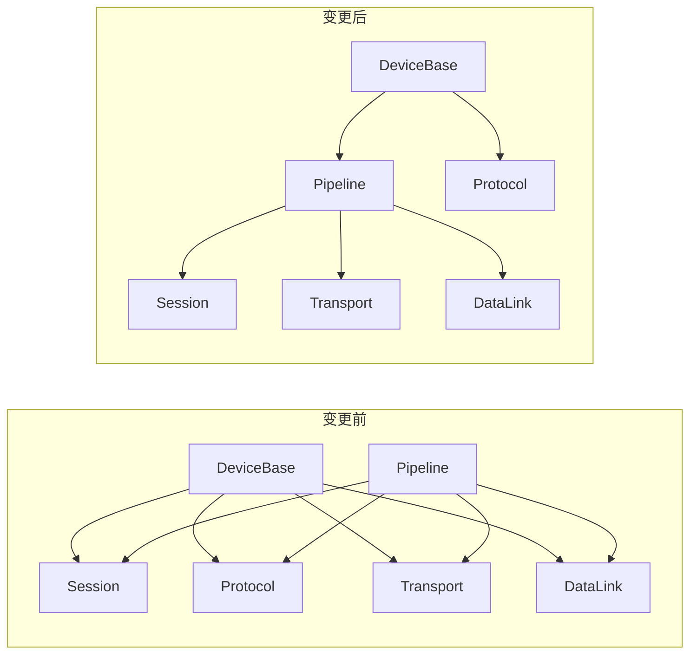

## 产品概述

重构 DeviceBase 基类，使其引用 Pipeline 项目并复用 `CommunicationPipelineBuilder` 组装完整的 OSI 通信栈。删除 DeviceBase 中重复的通信栈组装逻辑，确保 DeviceBase 完全使用 OSI 模型的整个链路。

## 核心功能

1. **DeviceBase 引用 Pipeline**：添加对 Pipeline 项目的项目引用
2. **删除冗余代码**：移除 DeviceBase 中的 `CreateSerialSession`、`CreateTcpSession` 等重复方法
3. **使用 CommunicationPipelineBuilder**：所有构造函数通过 Pipeline 组装 OSI 通信栈
4. **DeviceCommSettings 适配**：配置类返回 `CommunicationPipeline` 而非手动组装
5. **更新 DPSEX 设备**：适配新的基类结构
6. **更新测试**：确保所有测试继续通过

## 技术栈

- 语言：C# 10
- 目标框架：netstandard2.0 + net6.0（双目标）
- 构建系统：SDK-style csproj
- 测试框架：xUnit

## 技术架构

### 当前问题

`DeviceBase` 仅依赖 `ISession` + `IProtocolCodec`，每个设备子类（如 DPSEX）需要手动组装完整的通信栈：

```
Transport → DataLink → Session → DeviceBase
```

`CommunicationPipelineBuilder` 已存在但未与 `DeviceBase` 关联。

### 解决方案

**DeviceBase 引用 Pipeline 项目，复用 `CommunicationPipelineBuilder` 组装通信栈**：

1. **DeviceBase 引用 Pipeline**：添加对 Pipeline 项目的引用（Pipeline 已包含 Transport/DataLink/Session/Protocol）
2. **删除 DeviceBase 中重复的通信栈组装逻辑**：移除 `CreateSerialSession`、`CreateTcpSession` 等私有方法
3. **使用 CommunicationPipelineBuilder**：所有构造函数通过 Pipeline 组装完整 OSI 通信栈
4. **DeviceCommSettings 适配 Pipeline**：让配置类返回 `CommunicationPipeline` 而非手动组装

### OSI 模型链路

DeviceBase 确保使用完整的 OSI 模型链路：

```
物理层(IPhysicalTransport) → 数据链路层(IDataLink) → 会话层(ISession) → 协议层(IProtocolCodec)
         ↑                        ↑                      ↑                    ↑
    SerialPortTransport    DelimiterFrameStrategy    DirectSession        ConSTCodec
    TcpTransport           FixedLengthFrameStrategy  RetrySession         ModbusRtuCodec
    UdpTransport           ModbusRtuFrameStrategy                         ScpiCodec
```

### 核心设计决策

1. **DeviceBase 依赖 Pipeline**：复用 `CommunicationPipelineBuilder` 的灵活组装能力，不重复造轮子
2. **CommunicationPipeline 作为通信栈载体**：DeviceBase 内部持有 `CommunicationPipeline`，它封装了完整的 OSI 链路
3. **DeviceCommSettings 适配**：配置类的 `CreateCommunicationStack()` 改为返回 `CommunicationPipeline`
4. **ConstructDefaultInfo 虚方法**：基类提供空实现，子类重写以设置设备特定默认值
5. **保持向后兼容**：原有 `DeviceBase(ISession, IProtocolCodec)` 构造函数保留

### 实现细节

**DeviceBase 内部结构变更：**

```
public abstract class DeviceBase : IDisposable
{
    // 核心属性：持有完整的 CommunicationPipeline
    protected CommunicationPipeline Pipeline { get; }
    protected IProtocolCodec Codec { get; }
    protected ILogger Logger { get; }
    
    // 便捷属性：从 Pipeline 中提取
    protected ISession Session => Pipeline.Session;
    
    // 构造函数：通过 CommunicationPipelineBuilder 组装
    protected DeviceBase(IPhysicalTransport transport, IFrameStrategy frameStrategy, 
        IProtocolCodec codec, ILogger? logger = null)
    {
        Pipeline = new CommunicationPipelineBuilder()
            .UseTransport(transport)
            .UseDataLink(frameStrategy)
            .UseProtocol(codec)
            .Build();
        Codec = codec;
    }
    
    // 构造函数：使用预设
    protected DeviceBase(CommunicationPipeline pipeline, IProtocolCodec codec, ...)
    
    // 构造函数：向后兼容
    protected DeviceBase(ISession session, IProtocolCodec codec, ...)
}
```

**DeviceCommSettings 适配 Pipeline：**

```
public abstract class DeviceCommSettings
{
    // 返回完整的 CommunicationPipeline
    internal abstract CommunicationPipeline CreatePipeline(IProtocolCodec codec);
}

public class SerialPortSettings : DeviceCommSettings
{
    internal override CommunicationPipeline CreatePipeline(IProtocolCodec codec)
    {
        return new CommunicationPipelineBuilder()
            .UseTransport(new SerialPortTransport(PortName, BaudRate, DataBits, StopBits, Parity))
            .UseDataLink(new DelimiterFrameStrategy(Delimiter))
            .UseProtocol(codec)
            .Build();
    }
}
```

**需要从 DeviceBase 删除的冗余代码：**

- `CreateSerialSession()` 方法
- `CreateTcpSession()` 方法  
- `CreateSessionFromSettings()` 方法
- `_communicationStack` 字段（改为 `_pipeline`）

### 项目依赖变更



### 关键约束

- DeviceBase 引用 Pipeline，Pipeline 不依赖 DeviceBase（单向依赖）
- 保持原有构造函数签名不变（向后兼容）
- CommunicationPipeline 实现 IDisposable，DeviceBase 的 Dispose 委托给 Pipeline

## Agent Extensions

无需使用 Agent Extensions。